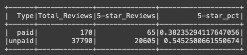

# Overview: Amazon Vine Analysis
 
The purpose of this analysis is to determine if the paid review program called vine creates a bais in the reviews it generates.  A dataset of reviews, including and identifier for vine reviews, has been provided for examination.  

# Results
  
- The results above show there were 170 vine and 37,790 non-Vine reviews in the data.
- Of those reviews 65 of the vine and 20,605 of the non-Vine reviews rated the prodcut 5-stars.
- Therefore, approximately 38% of vine and 55% of non-Vine reviews rated the prodcut 5-stars.

# Summary
This initial analysis suggests there is no positivity bias in the vine reviews, as the percentage of 5-star reviews is almost 20% lower.  A chi-squared test could be performed to quantify the degree of certainty we should have in this conclusion.  However both of these analyses examine only the 5-star review category for a positivity bias.  We could also examine the average star rating given by each population by using a two-sample t-test to see if there is an overall positivity bias as opposed to specifically 5-star reveiws.  

# Tools used
- pyspark
- colab
